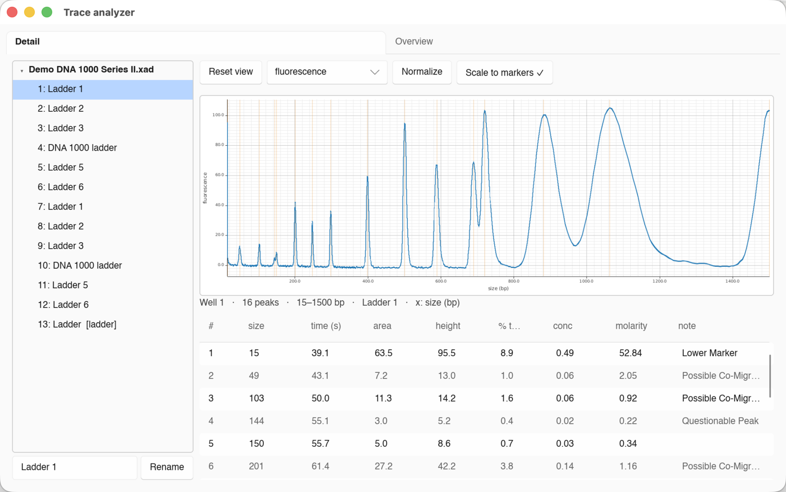

#  Trace analyzer

Open-source analysis tool for data from Agilent DNA/RNA analysis instruments

No hardware control yet; this software only reads and analyses saved runs.

> **This software needs testing. TapeStation support needs work. Please report other issues**



## Supported instruments

| Platform | Native format | Status |
|---|---|---|
| **Bioanalyzer 2100** | `.xad` | Native `.xad` opens as raw detector channels + metadata; exported `.xml`/`.xml.gz` opens with processed traces, peaks, sizing, concentration, molarity, and RIN. |
| **TapeStation** | `.D1000`/… (encrypted ZIP) | Native project files are encrypted; exported `.xml` + `_Electropherogram.csv` pairs open with traces, peaks, sizing, per-peak quantities, integrity values, and region bounds. |
| **Fragment Analyzer** | `.raw` + `.PKS` sidecars | Partial native reader: `.raw` CCD traces, `.txt` well/sample names, `.PKS` size anchors and peak tables. Concentration/molarity are computed from the standard ladder setpoints and decoded peak areas. |

**A note on Bioanalyzer `.xad` files:** a native `.xad` stores the **raw
detector signal and sample metadata only**. 2100 Expert recomputes the processed
per-well traces, peaks, sizing and RIN each time it opens the file — only its
*exports* (`File → Export to XML`, PDF) capture those numbers. So today, opening
a `.xad` shows the raw electropherograms and metadata, while opening an exported
`.xml` shows the full processed results. Reproducing the vendor's numbers from a
raw `.xad` is [on the roadmap](docs/architecture.md#roadmap).

## Getting started

Requires a [Rust toolchain](https://rustup.rs). Build and open a file with:

```sh
# GUI viewer — accepts .xad (native raw channels), .xml/.xml.gz, TapeStation CSV, FA .zip/.raw:
cargo run -p traceanalyzer -- path/to/run.xad
```

To try it without your own data, download the bundled demo runs and open one:

```sh
scripts/fetch-testdata.sh
cargo run -p traceanalyzer -- testdata/demo_dna1000.xml.gz
```

Running the GUI needs a working display. On Linux you may also need X11/Wayland
and GTK development packages; see [docs/development.md](docs/development.md) for
prerequisites, headless use, and the command-line `inspect` tool.

## Installing

CI builds downloadable artifacts for Windows and macOS on pushes, pull requests,
tags, and manual workflow runs. Windows is packaged as a single `.exe`; macOS is
packaged as a universal Intel + Apple Silicon `.app` bundle.

**Linux** — install the release binary, a `.desktop` launcher entry, and the app
icons into a standard [freedesktop](https://specifications.freedesktop.org)
layout, so Trace analyzer shows up in your application menu:

```sh
sudo make install                # into /usr/local (default)
make install PREFIX=~/.local     # per-user, no sudo
```

`make uninstall` (with the same `PREFIX`) removes them again. Packagers can stage
into a build root with `DESTDIR`. At runtime the GUI needs X11/Wayland plus GTK
(used for the file-open dialog).

**macOS** — build a double-clickable app bundle (with icon):

```sh
make osx-app                     # → target/osx/Trace analyzer.app
make osx-app-universal           # Intel + Apple Silicon bundle
```

## Documentation

- [docs/architecture.md](docs/architecture.md) — code layout, the `.xad` reader,
  and how calibration works.
- [docs/xad_format.md](docs/xad_format.md) — reverse-engineered `.xad` container
  and schema specification.
- [docs/fa_format.md](docs/fa_format.md) — reverse-engineered Fragment Analyzer
  `.raw`/`.PKS` notes and current reader limitations.
- [docs/development.md](docs/development.md) — building, testing, fixtures, and
  packaging.

## Credits

Format knowledge and demo data derive from the MIT-licensed R packages
`jwfoley/bioanalyzeR` and `grimbough/bioanalyzeR`.
